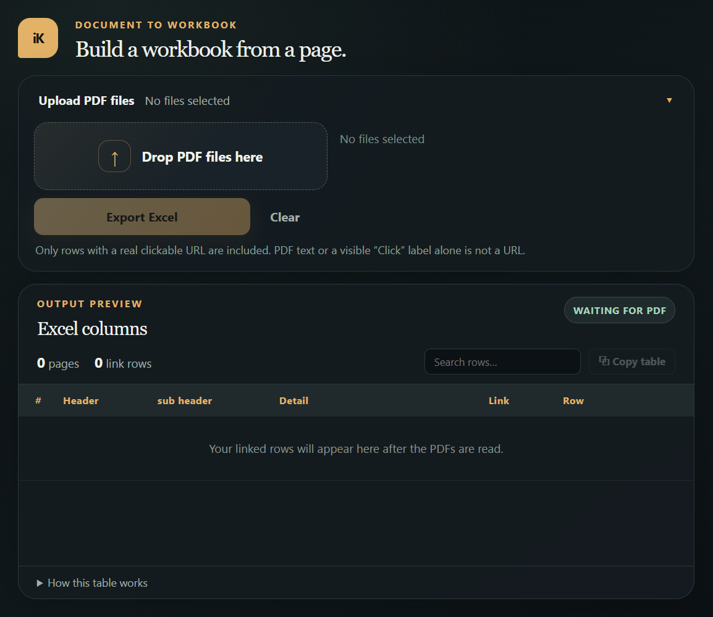
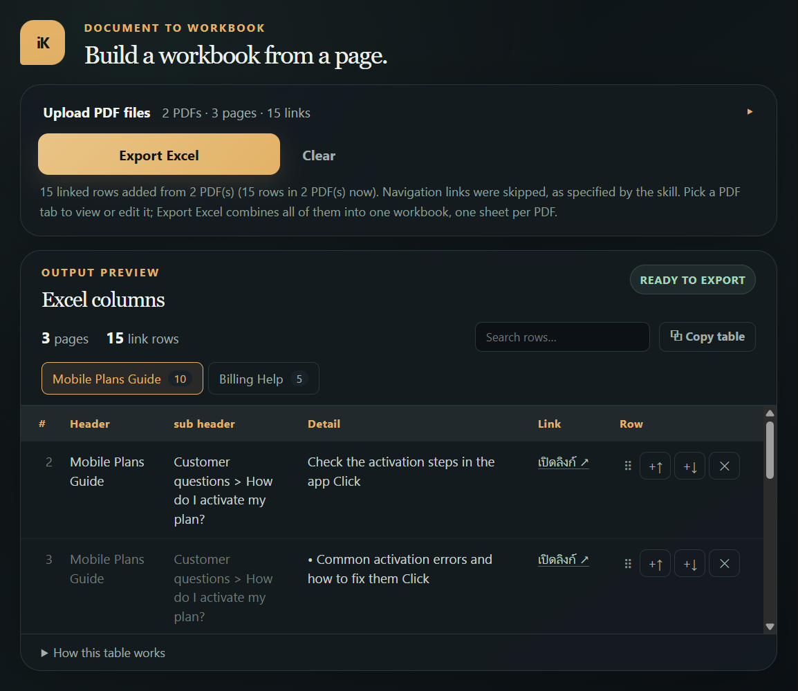
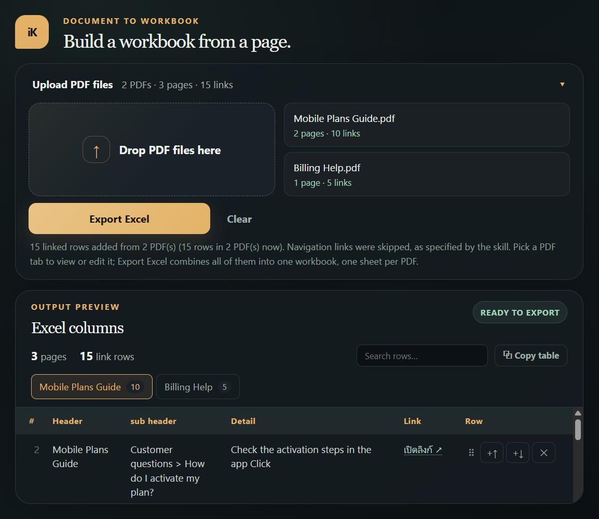
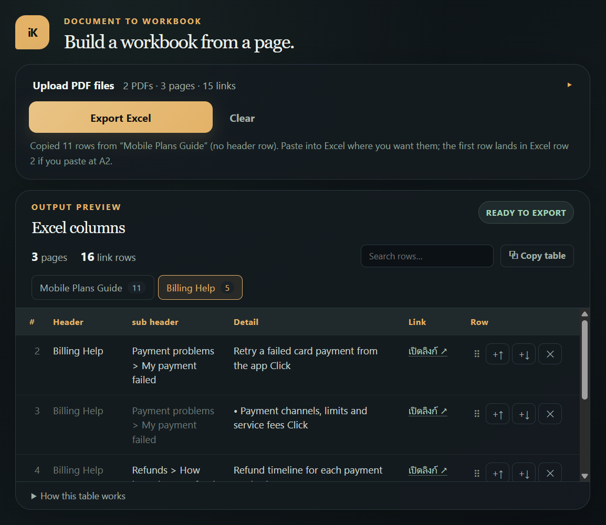
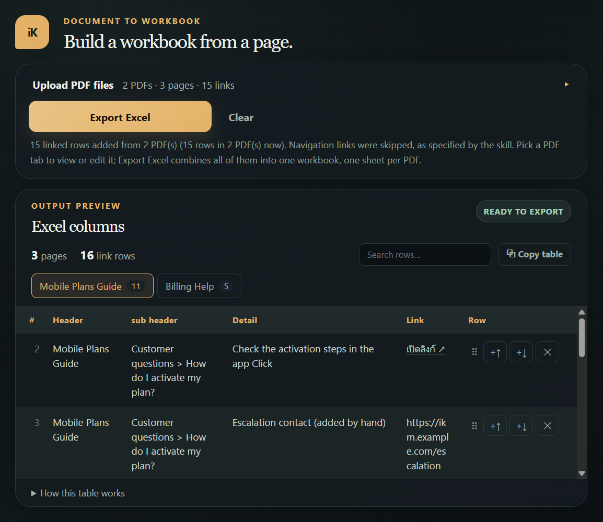
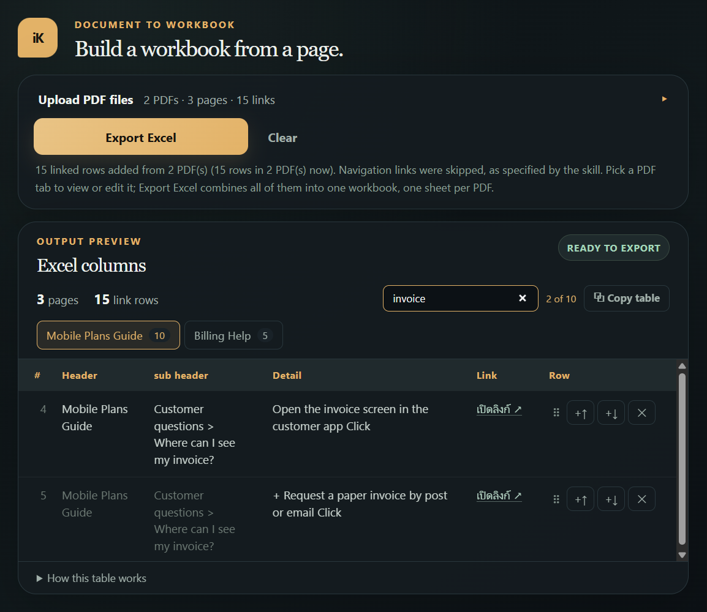
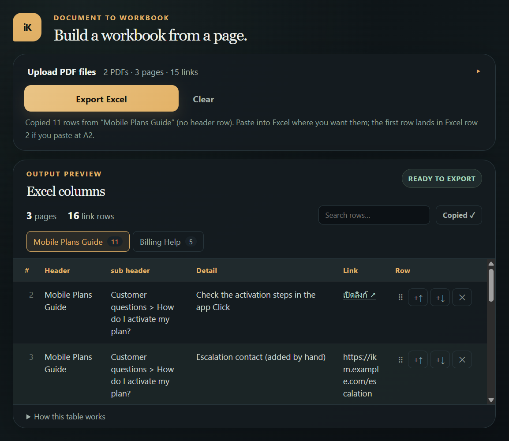

# iKM PDF to Excel

A local web app that turns browser-saved iKM pages (PDF) into an Excel workbook. Every clickable link in the PDF becomes a row; the rows are laid out in the nine columns of the sample file: **Header, sub header, Detail, Link, Link D, PRC, NLP, common, Web points**. You review and edit the rows in the browser first, then export (or copy) them.

- Only rows with a real clickable URL are kept. Text in the PDF, or a visible "Click" label, is not a URL.
- Several PDFs can be loaded at once. They are exported into **one workbook with one sheet per PDF**.
- Everything runs on your own computer. The server listens on `127.0.0.1` only.

## Contents

- [Quick start](#quick-start)
- [How to use it](#how-to-use-it)
- [The preview table](#the-preview-table)
- [What ends up in Excel](#what-ends-up-in-excel)
- [Tips and troubleshooting](#tips-and-troubleshooting)
- [Command-line use](#command-line-use)
- [Project layout](#project-layout)

## Quick start

```powershell
python -m pip install -r requirements.txt
python server.py
```

The terminal prints the address to open (default `http://127.0.0.1:8000/`). Set the `PORT` environment variable to use another port; if the port is busy the server tries the next ones. Press `Ctrl+C` in the terminal to stop it.

Requirements: Python with `openpyxl` and `PyMuPDF` (both in `requirements.txt`).



> The screenshots in this README were taken with two made-up sample PDFs ("Mobile Plans Guide" and "Billing Help"), not real iKM content.

## How to use it

1. **Save the iKM page as a PDF.** In Chrome or Edge open the page, then **Print → Save as PDF** (a screenshot, or "Microsoft Print to PDF", does not keep the links).
2. **Drop the PDF(s) into the Upload area**, or click it to browse. You can pick several PDFs at once.
3. **Wait for the progress bar.** The upload area then folds up into a single line such as `2 PDFs · 29 pages · 78 links`, and the table moves up.
4. **Review the table** (see [The preview table](#the-preview-table)): fix Detail text, adjust rows, search.
5. **Get the result**, either way:
   - **Export Excel** downloads one `.xlsx` (one sheet per PDF), or
   - **⧉ Copy table** copies the open tab so you can paste it into Excel yourself.



### Adding more PDFs later

Open the **Upload PDF files** panel again (click its header) and drop more PDFs. They are **added** to the ones already loaded and nothing you edited is lost. A PDF with the same name as one already loaded becomes `name (2)`. Wait for the current read to finish before adding more. **Clear** removes everything and asks for confirmation first.



### Several PDFs

The preview shows one **tab per PDF** with its row count. Click a tab to view or edit that PDF. The tabs only change what you see: **Export Excel** always writes every PDF, each on its own sheet.



## The preview table

| Column | What it shows |
| --- | --- |
| **#** | The row number as it will be in the Excel sheet. The header row is row 1, so the first data row is **2**. Each tab counts on its own and the search never renumbers rows. Web only, never exported. |
| **Header** | The page title. Written once per group in Excel; the grey repeats below are read-only. |
| **sub header** | Section / problem label. Shown only when it changes. |
| **Detail** | The link's text. |
| **Link** | `เปิดลิงก์ ↗` opens the original URL. In Excel this cell reads `URL` and carries the hyperlink. |
| **Row** | Row tools (below). |

What you can edit:

- **Detail** on every row.
- **Header / sub header** on the first row of a group (the grey rows below follow it).
- The **Link** of an extracted row stays the original URL.
- Cells accept **plain text only**: pasted formatting is dropped, line breaks become spaces, and `Enter` just leaves the cell.

Row tools (the **Row** column):

- `⠿` drag to reorder · `+↑` / `+↓` insert a new row above / below · `✕` delete.
- A row you add can have its own Header, sub header, Detail and **URL**, which must start with `http://` or `https://`; rows with an empty or invalid URL block the export until you fix or delete them.



Toolbar above the table:

- **Search rows…** filters the open tab by Header, sub header, Detail or URL and shows `N of M`. It only changes what you see: export and copy always include every row. Rows you just added stay visible while you search.
- **⧉ Copy table** (see below).



Describing links that have no text:

- A bare **Click / คลิก** button is described from the date or `Week N` label and the card text above it, and the sub header is the month heading.
- A link that is only a **picture** is described by its image name, read from the PDF's tags (the file name you would get from "Copy image address"), plus any text inside the clickable area. A PDF does not keep the full image address (`https://ikm.ais.co.th/ikm-file/…`), so that name is what you get; you can type the address into Detail yourself.
- Thai text is kept exactly as it was extracted.

### Copy table

**⧉ Copy table** copies the open tab laid out exactly as the Excel file would be, **without the header row**, so you can paste it straight into your own sheet:

- Header once per group, sub header only when it changes, `URL` hyperlink in Link, the last four columns blank.
- Paste at `A2` if you want the rows to line up with the `#` numbers.
- Excel receives a rich (HTML) copy, so the `URL` hyperlinks survive. Plain-text editors receive tab-separated text with the real URL in the Link column.



## What ends up in Excel

- **One sheet per PDF**, named after the PDF. A repeated name gets ` (2)`, and Excel limits sheet names to 31 characters.
- **Nine columns:** Header, sub header, Detail, Link, Link D, PRC, NLP, common, Web points. Only **Link** is hyperlinked (the cell reads `URL`). Detail is plain text. Link D, PRC, NLP, common and Web points are left blank for you to fill in.
- **Header** is written once per group and **sub header** only when it changes.
- **Every row is kept**, including rows that look identical. The `#` number on the web is the Excel row number.
- **Formula safety:** Excel reads a cell that starts with `=`, `+`, `-` or `@` as a formula, so Header, sub header and Detail that start with one of these get **one space in front** (for example ` + บันทึกข้อมูล`). This applies to both Export Excel and Copy table; the preview keeps the original text.
- **File name:** the PDF's name plus `_links.xlsx` (for several PDFs `ikm_pages_links.xlsx`), cleaned of characters Windows does not allow and limited to 31 characters including the extension.

## Tips and troubleshooting

- **"The bundled iKM PDF extractor or Excel builder is missing from scripts/"** on start-up: `scripts/extract_pdf_links.py` or `scripts/build_xlsx.py` is missing. Both must be present.
- **"No external clickable links were found" / zero rows (or a `NO LINKS` message):** the PDF was probably printed as an image. Save it again with the browser's **Save as PDF**.
- **Weird or old behaviour after changing code:** make sure only one `python server.py` is running. On Windows a second server can share the same port and answer some requests, so stop old ones before restarting.
- **Slow or large PDFs:** reading time depends on the page count. The progress bar moves to about 95% while the server works and finishes when it replies.
- The page itself does not scroll; only the table does. If your window is very short, the page scrolls as a last resort.

There are no automated tests. To check a change, run the app and convert a real browser-saved PDF, then export and open the workbook.

## Command-line use

The server calls these scripts, and you can run them yourself:

```powershell
python scripts/extract_pdf_links.py page.pdf --out rows.json [--header "Page title"] [--include-nav]
python scripts/build_xlsx.py --json rows.json --output result.xlsx [--fill-down] [--link-mode label|url] [--link-label TEXT]
python scripts/build_xlsx.py --json more.json --append result.xlsx
```

- `extract_pdf_links.py` writes `[{header, sheet?, rows: [{sub_header, detail, url, page}]}]` and skips navigation links (`#Home`, `#P1`…) unless `--include-nav`.
- `build_xlsx.py` accepts the same JSON. A `sheet` value puts the page on that sheet; pages with different `sheet` values become separate sheets. `--append` adds rows to an existing workbook and skips rows already in it.
- On a Windows console, set `$env:PYTHONIOENCODING = "utf-8"` first so Thai text prints correctly (the server does this for you).

## Project layout

| Path | Purpose |
| --- | --- |
| `server.py` | Serves the page and two endpoints: `POST /api/convert` (PDFs → rows, tagging each PDF as a sheet) and `POST /api/export` (reviewed rows → `.xlsx`, base64) |
| `scripts/extract_pdf_links.py` | Reads link annotations, text and image tags from a PDF (PyMuPDF) |
| `scripts/build_xlsx.py` | Writes the workbook (openpyxl), one sheet per `sheet` |
| `index.html`, `styles.css`, `script.js` | The browser interface: upload panel, preview table, tabs, search, copy, export |
| `docs/images/` | Screenshots used in this README (taken with made-up sample PDFs) |
| `requirements.txt` | `openpyxl` and `PyMuPDF` |
